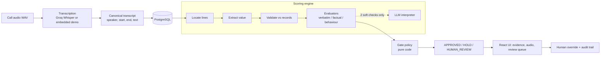

# CIMET QA Gate: Architecture, Defence Points and Interview Prep

A reading guide for presenting and defending the project. Read sections 1-3 first (10 minutes), then use section 4 (defence points) and section 5 (Q&A) to rehearse.

---

## 1. The project in 60 seconds

Sales calls are regulated. Before a sale is sent to the retailer, the call must be checked: were the required disclosures read out, did the rates, email, NMI and other details the agent confirmed match the records, was the payment recording muted, and so on.

**CIMET QA Gate** takes a call recording, turns it into a timestamped transcript, runs a set of data-driven checks against it, and produces one of three outcomes:

| Outcome | Meaning |
|---|---|
| **APPROVED** | Every check that matters passed with evidence. |
| **HOLD** | Something is provably wrong (for example a wrong rate). |
| **HUMAN_REVIEW** | The system cannot tell, or a check could not run. A person decides. |

The one rule everything follows from: **avoid a false pass at any cost.** Approving a bad sale is far worse than holding a good one.

**The gate is plain code. A language model helps read two soft checks and never decides the outcome.**

---

## 2. Architecture

### Layers (backend)

| Layer | Responsibility | Where |
|---|---|---|
| API | HTTP routes, validation, error mapping (503 when the database is down) | `backend/app/api/` |
| Services | Scoring engine, gate, transcription, evidence, normalization, demo tools | `backend/app/services/` |
| Repositories | Database access | `backend/app/repositories/` |
| Models | SQLAlchemy tables | `backend/app/models/` |
| Seed and demo | Reference data, 11 demo recordings | `backend/app/seed/`, `backend/app/demo/` |

### The evidence engine

Every check follows the same three steps, so results are explainable:

1. **Locate**: find the transcript lines that could be relevant (keywords, speaker, optional following lines for question then answer).
2. **Extract**: read the value out of those lines (a number, email, date, identifier, yes/no, phrase).
3. **Validate**: compare against the authoritative record (CRM lead data, or the rate card in force on the call date).

Each check returns **PASS, FAIL, UNCERTAIN or NOT_APPLICABLE** plus the quoted lines and their audio times.

### Evaluation methods

| Method | Used for | Deterministic? |
|---|---|---|
| Verbatim | Required wording (DMO disclosure, recording notice, cooling-off) | Yes |
| Factual | Email, NMI, date of birth, address, rates, move-in date, concession, gift card, life support | Yes |
| Behaviour | Dead air, interruptions, payment recording muted | Yes (from timestamps) |
| Semantic | Rapport, objection handling | **No: LLM, non-critical only** |

Checks live in the database (`check_definitions`), with a method, config, weight, critical flag and version. **A new rule is a row, not a code change.**

### The gate policy (first matching rule wins)

1. A check failed to run (error or incomplete) → **HUMAN_REVIEW**
2. Any critical check FAILS → **HOLD**
3. Any critical check is UNCERTAIN → **HUMAN_REVIEW**
4. A blocking non-critical check FAILS → **HOLD**
5. Otherwise → **APPROVED**

The **QA score** (0-100) is calculated separately and never overrides the gate. A score of 95 can still be a HOLD.

### Data and governance

- **Checklist versioning**: which rules apply depends on the call date.
- **Immutable scoring runs**: re-scoring creates a new run; old runs and evidence are never edited.
- **Human overrides** need a reason code and keep the machine result visible.
- **Audit events** record scoring, overrides, transcription and demo-data edits.
- **Storage**: PostgreSQL (runs in Docker on port 5433). SQLite is used **only by tests**.

### Audio and transcription

- Recordings are **dual-channel**: agent on the left, customer on the right. So *who spoke* is measured, not guessed. Speaker 2 = agent, Speaker 1 = customer.
- Each channel is transcribed separately with Groq Whisper (`whisper-large-v3-turbo`) with word timestamps.
- Whisper's timestamps drift, so each line is clamped to where speech was actually measured on that channel (voice activity detection).
- Merged turns are split back using word times; repeated words at segment boundaries are removed (never figures).
- **Embedded provider**: the generated demo WAVs carry their transcript inside a private WAV chunk, so the demo works offline and always gives the intended result.
- Mono audio is transcribed with speakers UNKNOWN, so speaker-dependent checks become UNCERTAIN.

### Where the LLM is used (exactly)

- Only **RAPPORT** and **OBJECTION_HANDLING**, both non-critical.
- Objection handling runs **only if the customer raised a concern** (checked with keywords first; otherwise NOT_APPLICABLE and no model call).
- Rapport sees only the opening and closing lines. The model may only cite lines it was shown; a PASS without a valid citation becomes UNCERTAIN.
- A **deterministic FAIL is never sent to the model.**
- The UI shows an **LLM** or **deterministic** badge on every check.
- Provider is Groq (`openai/gpt-oss-120b`) through an OpenAI-compatible adapter; a mock provider is used in tests and offline.

### Tools

Python 3.12, FastAPI, Pydantic v2, SQLAlchemy 2, Alembic, PostgreSQL 16 (Docker), pytest (260+ tests), React 18, TypeScript, Vite, React Router, Groq (chat and Whisper), Windows SAPI speech synthesis for demo audio.

---

## 3. What we verified, and what we did not

**Verified**
- 260+ automated tests pass (SQLite).
- All 11 demo recordings reach their intended gate through the running API using the embedded provider.
- A false-pass guard suite covers the known ways a wrong value could slip through.
- Live Groq Whisper: the clean call reached APPROVED and the objection-handled call reached APPROVED. The deliberately messy call landed on a more cautious gate.

**Not verified / limits (say these before you are asked)**
- Live speech recognition can lose decimals or merge turns on fast speech. Every error we saw moved a sale toward HOLD or HUMAN_REVIEW, never toward APPROVED.
- What speech recognition cannot rule out is a mis-heard figure that happens to equal the record. This is why every check links to the exact audio moment.
- Mono audio gives UNKNOWN speakers.
- Groq's free tier is rate-limited.
- Demo audio generation needs Windows.
- The UI was not exhaustively tested in browsers.
- **Policy choice:** a check that errors sends an otherwise clean sale to HUMAN_REVIEW ("a failed execution never approves"). This can be relaxed if the business wants.

---

## 4. Defence points

### Why not use an LLM for the checks?

1. **Exact answers have exact tools.** A rate is 33.14 or it is not. An email matches or it does not. Code does this perfectly; a model adds risk and no value.
2. **Repeatability.** Same call, same result, every time. A model can give different answers on different days or after a version change.
3. **Explainability.** Each result shows the quote, the rule and the record value. "The model said pass" is not defensible to an auditor.
4. **A confident wrong answer is the worst failure.** A model can be fluent and wrong. Our priority is avoiding a false pass, so the model must never be the last word.
5. **Testability.** Deterministic evaluators can have hundreds of unit tests; a model cannot be tested to the same standard.
6. **Cost, latency, limits.** No tokens, no rate limits, works offline. The free Groq tier is only 8,000 tokens per minute.
7. **Privacy.** Less of the transcript leaves the system.

### Then why use an LLM at all?

Rapport and objection handling have **no exact answer**. Rules cannot judge whether an agent was warm or acknowledged a concern properly. A model is the right tool for a judgement call, so we use it there, bounded: non-critical, minimal input, citations validated, and it cannot approve or hold a sale by itself.

### "Isn't the LLM just a fallback when the rules fail?"

No. A deterministic FAIL is final and is never re-asked to a model. The model is not consulted to rescue a failed check. It only handles the two checks that cannot be expressed as rules.

### Why does uncertainty go to a human instead of a best guess?

Because the costs are asymmetric. A false hold costs a reviewer a few minutes. A false pass can mean a compliance breach. We chose the safe error.

### Why data-driven checks?

The checklist changes by retailer, vertical and date. Rules stored in the database can be versioned, audited and changed without deploying code, and the version applied depends on the call date.

### Why immutable runs and preserved overrides?

Auditors need to know exactly what the system concluded at the time and what a human later changed. Overwriting either destroys that record.

### Why dual-channel audio?

It makes speaker identification a measurement rather than a model guess, and it lets us check timing (interruptions, dead air) reliably.

### Why PostgreSQL, and why does SQLite appear?

PostgreSQL is the real database (JSONB, concurrency, proper migrations). SQLite is used only so tests run fast without a server. The app never uses SQLite in normal operation.

### Why Groq?

Fast inference, an OpenAI-compatible API (so the provider is swappable), and a free tier suitable for a demo. The adapter isolates the provider, so changing it is a configuration change.

---

## 5. Interview questions and answers

### Concept and design

**Q1. In one sentence, what does your system do?**
It scores a sales call from its recording and produces APPROVED, HOLD or HUMAN_REVIEW using deterministic rules backed by transcript evidence, with an LLM used only for two soft checks.

**Q2. What is your main design principle?**
Never approve on uncertainty. We would rather hold a good sale than approve a bad one, so every ambiguity resolves toward FAIL or UNCERTAIN, never PASS.

**Q3. How is the final decision made?**
By a small ladder of rules in code: an execution error or a critical UNCERTAIN gives HUMAN_REVIEW; a critical FAIL or a blocking non-critical FAIL gives HOLD; otherwise APPROVED. The first matching rule wins.

**Q4. Where exactly is the LLM used?**
Two non-critical behaviour checks: rapport and objection handling. Nowhere else. Objection handling only runs if the customer raised a concern.

**Q5. Can the LLM approve or hold a sale?**
No. Its output is one check result, validated by the evaluator. A PASS without a valid citation is downgraded. Those checks are non-critical, so alone they cannot cause an approval of a sale that failed a critical check.

**Q6. Could a non-critical LLM check ever change the gate?**
Only through the two paths designed for it: a non-critical check marked *blocking* can cause a HOLD, and an error running any check causes HUMAN_REVIEW. Neither can produce an APPROVED that the deterministic checks did not already allow.

**Q7. What happens if the model provider is down or rate-limited?**
The check comes back as an errored execution, marked UNCERTAIN, and the gate sends the sale to HUMAN_REVIEW. It never approves. Retries are bounded and honour the provider's "try again in N seconds".

**Q8. How do you stop the model inventing evidence?**
It can only cite line IDs it was shown. Citations are validated against those lines, invalid ones are discarded, and a PASS with no valid citation becomes UNCERTAIN.

### Evidence and checks

**Q9. Walk me through one check, say peak rate.**
Locate lines mentioning "peak rate" (word-boundary matching so "off-peak" does not match) plus the next couple of lines. Extract every number that has a rate unit (cents, kWh) and flag hedged ones ("around", "between"). Validate against the rate card in force on the call date. A single clear match passes, a different value fails, a hedge or conflicting values or a missing record gives UNCERTAIN.

**Q10. How do you avoid a false pass on numbers?**
Only unit-bearing numbers count, "for" is never read as 4, hedged or range values are unverified, conflicting values escalate, a missing authoritative value is UNCERTAIN, and low speech-recognition confidence on a critical check is UNCERTAIN.

**Q11. Why is "off-peak" a problem?**
A naive search for "peak rate" also matches inside "off-peak rate", so an off-peak figure could be read as the peak rate and cause a wrong pass or fail. We match on word boundaries and exclude that case.

**Q12. How do you handle speech-to-text errors in required phrases?**
Verbatim checks tolerate run-together or split words across adjacent lines (for example "assuranceand"), but only at MEDIUM confidence, only across the same speaker, and never for very short phrases.

**Q13. What is NOT_APPLICABLE?**
A check whose trigger did not occur, for example objection handling when the customer raised no concern, or the payment-mute check when no payment was collected. It is decided by code, not by a model.

**Q14. Which rate is used when rates change?**
The rate card in force on the call date, not today's. Rates and checklists are date-versioned.

### Transcription and audio

**Q15. How do you know who is speaking?**
Recordings are dual-channel, agent on one and customer on the other. Each channel is transcribed on its own, so the speaker is known from the channel. Mono audio returns UNKNOWN and speaker-dependent checks become UNCERTAIN.

**Q16. Whisper timestamps are inaccurate. What did you do?**
We measure where speech actually occurs on each channel (voice activity detection) and clamp each line inward to it. That fixed drift of up to about 20 seconds down to a few seconds on our worst case, and it only ever shrinks a line, never extends it into someone else's turn.

**Q17. Why the "embedded" provider?**
The demo recordings are synthetic speech that carry their own transcript inside the WAV. It lets the demo work offline and deterministically. It is labelled as a demo provider everywhere in the UI.

**Q18. Did you give Whisper a prompt to improve accuracy?**
We tried and removed it. It leaked its own words into the transcript ("Prices are you moving in"). A compliance transcript must contain only what was said.

**Q19. How reliable is live transcription?**
Good on clean calls, weaker on fast, messy speech (it can drop decimals or merge turns). Every error we observed made the gate more cautious. The residual risk is a mis-heard figure that equals the record, which is why each check links to the audio moment for a human spot check.

### Data, governance, security

**Q20. How do you keep history trustworthy?**
Scoring runs are immutable. A re-score creates a new run. Overrides are stored separately with a reason code and the machine result stays visible. Everything is in the audit log.

**Q21. How does versioning work?**
Checklist versions are effective by date. A call is scored with the version that applied on the call date. Changing a rule creates a new version rather than editing history.

**Q22. How do you demonstrate rescoring?**
On the Demo data page (only when DEMO_MODE is on) we edit an authoritative value such as the rate card, re-score, and the run comparison shows HOLD becoming APPROVED. The edit is audited and the old run remains.

**Q23. How are secrets handled?**
The API key lives in `backend/.env`, which is git-ignored. `.env.example` has placeholders only. A key was once pasted into the template by mistake; it was moved to `.env` and rotation was recommended.

**Q24. What about personal data?**
The sample transcript came with PII already removed and demo values are synthetic. The engine has redaction for card numbers and one-time codes read aloud.

### Engineering and quality

**Q25. How did you test it?**
260+ tests: unit tests for each evaluator and normalizer, a false-pass guard suite, scenario tests for all 11 demo calls, API tests, transcription tests using a fake HTTP layer, and LLM boundary tests using a recording interpreter that proves what the model was shown.

**Q26. What was the hardest bug?**
Live transcription. Word-level splitting glued words together ("Anddoyouhold…") because the word entries carry no spaces, which silently pushed many checks to UNCERTAIN. The tests had used spaced words, so they hid it. We added tests with the real shape.

**Q27. What would you do with more time?**
Second-opinion checks for mis-heard figures, authentication and reviewer roles, adapters to the real CRM and checklist schema, and a paid model tier for bulk scoring.

**Q28. How would this scale?**
Scoring is stateless and per lead, so it can run in a worker pool. The database and audio storage sit behind interfaces (local files today, object storage later). The model is the main throughput limit, and it is used for only two checks.

**Q29. What is the weakest part of the design?**
Reliance on speech recognition for the input. We mitigate it by failing safe, but a human spot check via the audio timestamp is still the last line of defence.

**Q30. A check errors and blocks an otherwise perfect sale. Is that right?**
It is a deliberate policy ("a failed execution never approves"). If the business considers it too strict for non-critical checks, it is a one-line policy change plus a test.

---

## 6. What to learn so you can defend and promote this project

**Must know cold**
- The gate ladder and why each rule is in that order.
- The list of which checks are critical and which use the LLM.
- Why deterministic first (section 4).
- The 8 false-pass guards, with two examples you can explain (off-peak, hedged rates).
- Immutability, versioning by call date, override with reason code.
- The demo flow and the outcome of each of the 11 recordings (`backend/demo_calls/DEMO_SHEET.md`).

**Should understand**
- FastAPI dependency injection and Pydantic validation.
- SQLAlchemy models and Alembic migrations, and why JSONB is used.
- What a dual-channel WAV is, and what voice activity detection does.
- What Whisper returns (segments, word timestamps, average log-probability) and how confidence was derived from it.
- Rate limits and retry behaviour for the Groq API.
- The difference between a critical, blocking and non-critical check.

**Nice to have**
- Basic Australian energy vocabulary: NMI, MIRN, DMO (default market offer), concession, supply charge, cooling-off period.
- Precision vs recall trade-offs (we optimise for zero false passes, accepting more false holds).
- Prompt-injection and hallucination risks for LLMs in compliance workflows.
- Auditability and evidence standards in regulated industries.

**Promotion angles**
- "The AI helps read, the code decides."
- "Every result is a quote and a timestamp you can click and hear."
- "When unsure, we escalate. We never guess."
- "Rules are data: a compliance analyst's change is a row, not a release."
- "We show the limits ourselves, before anyone asks."

---

## 7. Demo cheat sheet

1. Start Docker Desktop → `docker start cimet-qa-postgres`.
2. Backend: `cd backend`, then `.\.venv\Scripts\python -m uvicorn app.main:app --reload --port 8000`.
3. Frontend: `cd frontend`, then `npm run dev` and open the printed URL.
4. **Add Lead** → choose `backend\demo_calls\01_clean_approve.wav` → provider *Demo embedded transcript* → **Transcribe** → *Fill sample details* → **Save & Score** → **APPROVED**.
5. Repeat with `02_wrong_rate_hold.wav` → **HOLD**; open the failing check, show the quote and click the audio time.
6. Repeat with `06_life_support_unclear_review.wav` → **HUMAN_REVIEW**; explain why uncertainty is not a pass.
7. **Demo data** → edit the rate card for the HOLD lead → open the lead → **Re-score** → run comparison shows HOLD → APPROVED.
8. Mention Groq Whisper as the live option, and the limitations from section 3.
